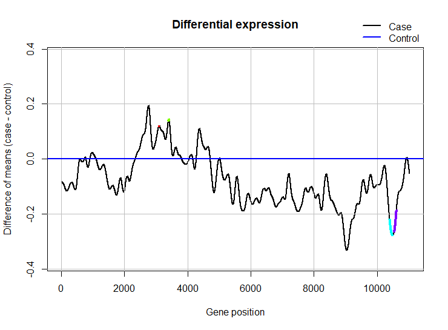

**Version**: `r packageDescription("transcriptogramer")[["Version"]]`<br />


# Overview
The transcriptogramer package is designed for transcriptional analysis
based on transcriptograms,
a method to analyze transcriptomes that projects
expression values on a set of
ordered proteins, arranged such that the probability that gene products
participate
in the same metabolic pathway exponentially decreases with the increase of
the distance between two proteins of the ordering. Transcriptograms are,
hence, genome wide gene expression profiles that provide a global view for
the cellular metabolism, while indicating gene sets whose expression are
altered [@Silva2014; @Filho2011].

Methods are provided to analyze topological properties of an
interactome, to generate transcriptograms, to detect and to display
differentially expressed gene clusters, and to perform a functional 
enrichment analysis on these clusters.

As a set of ordered proteins is required in order to run the methods,
datasets are available for four species (*Homo sapiens*, *Mus musculus*,
*Saccharomyces cerevisiae* and *Rattus norvegicus*). Each species has three 
datasets, originated from [STRINGdb](https://string-db.org/) release 10.5
protein network data, with combined scores greater than or equal to 700, 800
and 900 (see **Hs900**, **Hs800**, **Hs700**, **Mm900**, **Mm800**, **Mm700**,
**Sc900**, **Sc800**, **Sc700**, **Rn900**, **Rn800** and **Rn700** datasets).
Custom sets of ordered proteins can be generated from protein network data using
[The transcriptogramer](https://lief.if.ufrgs.br/pub/biosoftwares/transcriptogramer/)
on Windows.

# Quick start
The first step is to create a Transcriptogram object by running the
`transcriptogramPreprocess()` function. This example uses a subset of the
*Homo sapiens* protein network data, from STRINGdb release 10.5, containing only
associations of proteins of combined score greater than or equal to 900
(see **Hs900** and **association** datasets).

```{r message = FALSE}
library(transcriptogramer)
t <- transcriptogramPreprocess(association = association, ordering = Hs900)
```

## Topological analysis
There are two methods to perform topological analysis,
`connectivityProperties()` calculates average graph properties as function
of node connectivity, and `orderingProperties()` calculates graph
properties projected on the ordered proteins. Some methods, such as
orderingProperties(), uses a window, region of n (radius * 2 + 1) proteins
centered at a protein, whose radius changes the output. The Transcriptogram
object has a **radius** slot that can be setted during, or after, its
preprocessing (see **Transcriptogram-class** documentation).

```{r message = FALSE}
## during the preprocessing

## creating the object and setting the radius as 0
t <- transcriptogramPreprocess(association = association, ordering = Hs900)

## creating the object and setting the radius as 50
t <- transcriptogramPreprocess(association = association, ordering = Hs900,
                               radius = 50)
```
```{r message = FALSE}
## after the preprocessing

## modifying the radius of an existing Transcriptogram object
radius(object = t) <- 25

## getting the radius of an existing Transcriptogram object
r <- radius(object = t)
```

The output of the orderingProperties() method is partially affected by
the radius slot.

```{r message = FALSE}
oPropertiesR25 <- orderingProperties(object = t, nCores = 1)

## slight change of radius
radius(object = t) <- 30

## this output is partially different comparing to oPropertiesR25
oPropertiesR30 <- orderingProperties(object = t, nCores = 1)
```

As the connectivityProperties() method does not uses a window, its output is not
affected by the radius slot.

```{r message = FALSE}
cProperties <- connectivityProperties(object = t)
```

## Transcriptogram
A transcriptogram is generated in two steps and requires expression values,
from microarray or RNA-Seq assays (log2-counts-per-million), and a dictionary. This example uses the
datasets **GSE9988**,
which contains normalized expression values of 3 cases and 3 controls (GSM252443, GSM252444, GSM252445, GSM252465, GSM252466 and GSM252467 respectively),
and **GPL570**, a mapping
between ENSEMBL Peptide ID and Affymetrix Human Genome U133 Plus 2.0 Array
probe identifier.

The methods to generate a transcriptogram are `transcriptogramStep1()` and
`transcriptogramStep2()`. The transcriptogramStep1() assigns to each protein,
of each transcriptome sample, the average of the expression values of all the
identifiers related to it.

```{r message = FALSE}
t <- transcriptogramStep1(object = t, expression = GSE9988,
                          dictionary = GPL570, nCores = 1)
```

To each position of the ordering, the transcriptogramStep2() method assigns a
value equal to the average of the expression values inside a window, which
considers periodic boundary conditions to deal with proteins near the ends of
the ordering, in order to reduce random noise.

```{r message = FALSE}
t <- transcriptogramStep2(object = t, nCores = 1)
```

The Transcriptogram object has slots to store the outputs of the
transcriptogramStep1() and transcriptogramStep2() methods, called
transcriptogramS1 and transcriptogramS2 respectively. As the output of some
methods are affected by the content of the transcriptogramS2 slot, it can be
recalculated using the content of the transcriptogramS1 slot.

```{r message = FALSE}
radius(object = t) <- 80
t <- transcriptogramStep2(object = t, nCores = 1)
```

## Functional enrichment analysis
As nearby genes of a transcriptogram have a high probability to interact with
each other, gene sets whose expression are altered can be identified using the
`r Biocpkg("limma")` package. The `differentiallyExpressed()` method uses the
limma package to identify differentially expressed genes (the approaches voom and trend are supported for RNA-Seq), for the contrast
"case-control", grouping as a cluster
a set of genes which positions are within a radius range specified by the
content of the radius slot.

For this example, the p-value threshold for false
discovery rate will be set as 0.01. If the name of a species is provided
on the input, the `r Biocpkg("biomaRt")` package will be used to translate the
ENSEMBL Peptide ID to Symbol (Gene Name), alternatively, a data.frame can be
provided and used instead.
The levels argument classify the columns of
the transcriptogramS2 slot referring to samples, as there are 6 columns (see
dataset **GSE9988**), is created a logical vector that uses TRUE to label the
columns referring to controls samples, and FALSE to label the
columns referring to case samples.

```{r message = FALSE, fig.show = "hide"}
## trend = FALSE for microarray data or voom log2-counts-per-million
## the default value for trend is FALSE
levels <- c(rep(FALSE, 3), rep(TRUE, 3))
t <- differentiallyExpressed(object = t, levels = levels, pValue = 0.01,
                             trend = FALSE)
```
```{r eval = FALSE}
## translating ENSEMBL Peptide IDs to Symbols using the biomaRt package
## Internet connection is required for this command
t <- differentiallyExpressed(object = t, levels = levels, pValue = 0.01,
                             species = "Homo sapiens")

## translating ENSEMBL Peptide IDs to Symbols using the DEsymbols dataset
t <- differentiallyExpressed(object = t, levels = levels, pValue = 0.01,
                             species = DEsymbols)
```

This method also produces a plot referring to its output. In this case,
eleven clusters were detected, and each one is represented by a color. It is
important to mention that not all the colored genes were detected as
differentially expressed, but, as they were within the radius specified by
the content of the radius slot, they were included in a cluster. The genes that
are above the horizontal black line are upregulated, and the genes that
are below are downregulated.



The differentially expressed genes identified by this method are stored in the
DE slot of the Transcriptogram object, its content can be obtained using the
DE method. By default, the p-values are adjusted by the Benjamini-Hochberg
procedure.

```{r message = FALSE}
DE <- DE(object = t)
```

The `clusterVisualization()` method uses the `r Biocpkg("RedeR")` package to
display graphs of the differentially expressed clusters and returns an
object of the RedPort Class, allowing interactions through functions
of the RedeR package. This method may take some time depending on the number of
clusters, and nodes per cluster, and requires the Java Runtime Environment
(>= 6). If the DE slot of the Transcriptogram object has a column named Symbol,
its contents will be used as node alias.


```{r eval = FALSE}
rdp <- clusterVisualization(object = t)
```


The `clusterEnrichment()` method perform a functional enrichment analysis
using the `r Biocpkg("topGO")` package. By default, the universe is composed by
all the proteins present in the transcriptogramS2 slot, the ontology is setted
to biological process, the algorithm is setted to classic, the statistic is
setted to fisher, and the p-values are adjusted by the Benjamini-Hochberg
procedure. For this example, the p-value threshold for false
discovery rate will be set as 0.005. This method uses the biomaRt package to
build a gene2GO list if the name of a species is provided on the input,
alternatively, a data.frame can be provided and used instead.

```{r message = FALSE}
## using the HsBPTerms dataset to create the gene2GO list
terms <- clusterEnrichment(object = t, species = HsBPTerms,
                           pValue = 0.005, nCores = 1)
```
```{r eval = FALSE}
## using the biomaRt package to create the gene2GO list
## Internet connection is required for this command
terms <- clusterEnrichment(object = t, species = "Homo sapiens",
                           pValue = 0.005, nCores = 1)
```
```{r echo = FALSE}
load("terms.RData")
```
```{r}
head(terms)
```

# Session info

```{r}
sessionInfo()
```

```{r}
warnings()
```
# References
